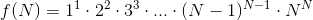

#### Problem 2
###### CodeChef Code: `POWERMUL`
## Fombinatorial

You are given a function f which is defined as:

Your task is to find the value of `f(N) / (f(r) * f(N-r))`.

As it will be a large number, output it modulo M.

#### Input

First line contains **T**, the number of test cases to follow.

Next follow **T** test cases.

First line of every test case contains 3 space separated integers **N**, **M** and **Q**.

Next, **Q** lines follow, each line contains **r**.

#### Output

For every test case, output **Q** lines, each line containing the answer.

#### Constraints

- **2** ≤ **N** ≤ **105**
- **1** ≤ **M** ≤ **509**
- **1** ≤ **r** ≤ **N**

#### Example

**Input:**  

    1
    5 24 2
    2
    3

**Output:**

    8
    8

**Explanation:**

    f[1] = 1

    f[2] = 4

    f[3] = 1*22*33 = 108

    f[4] = 1*22*33*44 = 27648

    f[5] = 1*22*33*44*55 = 86400000

Value of `f[5] / (f[2]*f[3]) = 200000` and `200000%24` is `8`.
